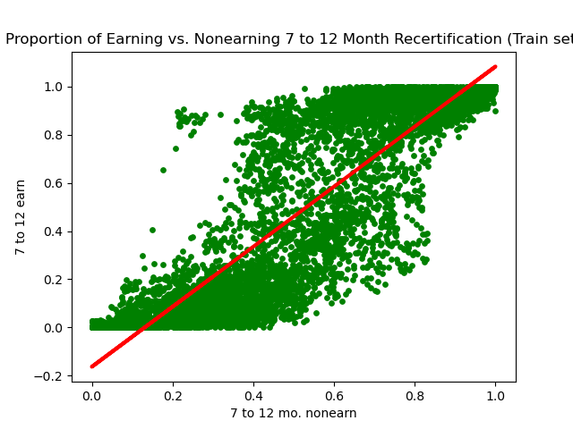
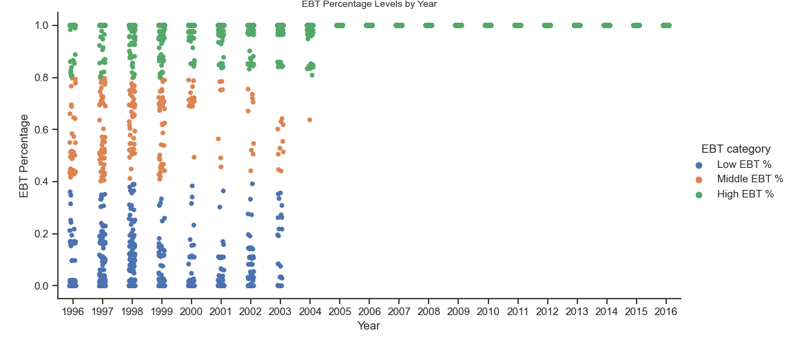
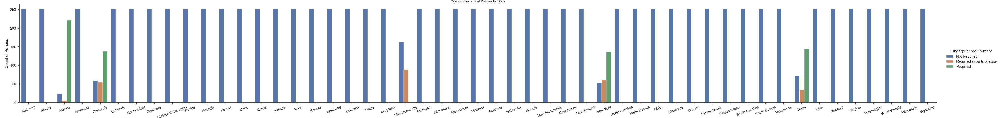
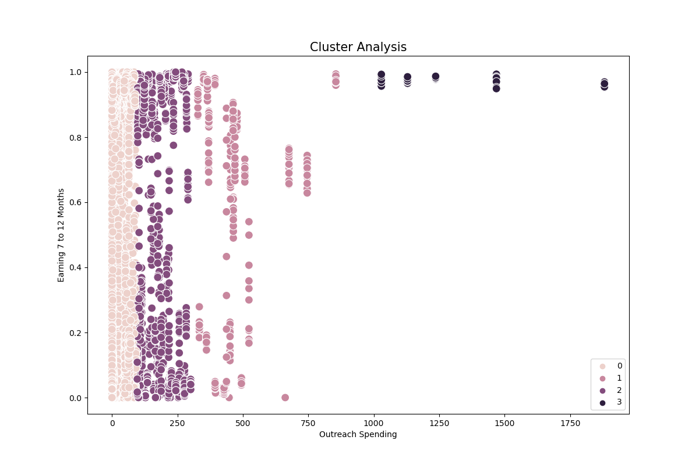

# SNAP Policies and Participation: Project Overview
Utilizing the Supplemental Nutrition and Assistance Program (SNAP) Policy Database, I conducted a thorough analysis aimed at identifying shifts in state policies and participation rates over time. Insights include relationships between SNAP recipient groups, relationships between different policies, and identification of policies potentially affecting participation rates. Python was used to clean data, perform exploratory analysis, and create data visualizations to detect relationships between different variables. Tableau was used to develop a user-friendly dashboard and supplemental visualizations.

## Tools & Skills
Python Version: 3.11
Tableau

Packages: pandas, NumPy, Matplotlib, seaborn, folium, json, sklearn, pylab, statsmodels
* Executed data wrangling and cleaning operations prior to analysis.
* Conducted geospatial analysis using a shapefile to create a choropleth map.
* Performed linear regression analysis and analyzed model performance statistics.
* Used elbow technique to prepare data for cluster analysis using k-means algorithm.
* Tested data for stationarity using Dickey-Fuller test and autocorrelation plots.
* Differenced data to ensure stationarity before conducting time-series analysis.

## Purpose & Context
I independently sourced relevant and reliable datasets to educate the general public and policy makers about SNAP. Advanced exploratory analysis techniques were used to gain a deeper understanding of the differences in participation and policies over time. An interactive dashboard was created to easily convey the complexity in the data.

## Data Cleaning & Transformation
Following a comprehensive descriptive analysis of the data, I identified several areas where data cleaning and transformation were necessary. Here's a summary of the changes and modifications that were made:

* Omitted irrelevant columns "state_pc" and "state_fips".
* Generated dictionaries to assign accurate data types and standardized column names for consistency and clarity.
* Separated year and month values into separate columns for better data organization.
* Checked for mixed data types, missing data, and duplicate entries was conducted.
* Missing values in the data set represent time points when policy data was not available at time of data collection.
* Utilized "loc()" function in Python to create categorical columns, such as:
  * "EBT category" to define different percentage levels of benefits allocated through electronic benefit transfers (EBT).
  * "Fingerprint requirement" to identify states with certain fingerprint requirements.

## Visualizations
The correlation heatmap was constructed using the Seaborn heatmap function in Python to reveal connections among variables and unveil the influence of specific factors on one another. Notably, five policies displayed significant correlations with each other:

Broad-Based Categorical Eligibility (BBCE) allows states to increase income and asset eligibility limits for low-income households. BBCE demonstrated a moderate positive correlation (0.59) with policies that refrain from imposing limitations on the number of household vehicles considered as assets.

Policies that do not impose restrictions on household vehicles and policies that offer the simplified reporting option had a slightly stronger correlation (0.61). Simplified reporting reduces the requirements for households to reporti changes in their circumstances. 

Policies that allow telephone interviews (instead of face-to-face interviews) during initial certification had a moderate positive correlation with policies that allow households to apply for SNAP online (0.59). 

A strong positive linear correlation of 0.89 was identified between individuals categorized as earners and non-earners, particularly among those subject to recertification periods lasting 7 to 12 months. I hypothesized that as earning proportions increase, nonearning proportions will also increase. To test this hypothesis, a linear regression analysis was conducted to examine how variations in the proportion of earners impact the proportions of non-earners. The model's performance metrics revealed promising results, with a mean squared error of 0.0339 and an R2 score of 0.7973 for the training set. These statistics indicate that the model exhibits strong predictive capability and aligns well with the data. This relationship is likely due to nonearning individuals, such as children or other dependents, living in the same household as earning individuals. 

The EBT categorical plot was constructed to visualize the distribution of dollar percentages issued through EBT. Beginning in most of 2004 and onward, at least 80% of SNAP benefits were distributed via EBT across all states. 

The fingerprint categorical plot was created to show which states reported certain fingerprint requirements. States could report "not required", "required in parts of state", or "required". Arizona, California, Massachusetts, New York, and Texas reported fingerprint requirements for SNAP applicants.

A cluster analysis was performed using the k-means algorithm to identify groups within the raw data. A scatter plot comparing outreach spending and the proportion of earning individuals identified outlier data that was segregated into its own group. I consulted the original dataset and determined that this group represented outreach spending for the state of California. California has spent significantly more on outreach spending than other states. The remaining three cluster groups likely represent the earning, nonearning, and elderly groups.

## Recommendations & Findings
Based on the insights derived from the analysis, several recommendations can be made:

* Certain states have consistently high estimated participation rates. The difference between top performing states in 2016 was the presence of policies that grant waivers to allow telephone interviews at initial certification. The presence of this policy became more prevalent at the same time when proportions of earning and nonearning individuals increased.

Recommendation: Remove barriers that prevent eligible populations from easily applying and recertifying for SNAP. Individuals should not be penalized because they lack the resources, such as time and transportation, to receive food assistance. Accomodations that consider these limitations for low-income households will encourage participation.

* Vermont participation rates were high in 2013, but not in 2011. Policies granting waivers for in-person initial certification interviews was implemented in Vermont for the first time in January 2007, removed in April 2011, and reinstated in September 2012.
Recommendation: Policy makers should avoid frequent policy changes because this may be disruptive to eligible populations. Participants could suddenly lose eligibility and it may be difficult for individuals to understand the program's limitations and requirements.

## The Learning Experience
A choropleth map was generated to illustrate the average distribution of reported call centers across the United States, utilizing a scale where 0 denotes no call center presence, 1 indicates a call center, and 2 represents a call center situated in specific parts of a state. Unfortunately, the map's effectiveness in this analysis was limited due to the inability to appropriately adjust the color scale to accurately reflect the data.

A time series analysis was conducted to predict the average recertification period for recipient groups, along with the proportions of various recipient groups. Unfortunately, the forecasted trend line did not align well with the actual data. As a result, it was determined that this model might not be suitable or offer valuable insights for this analysis.

## Datasets 
Economic Research Service (ERS), U.S. Department of Agriculture (USDA). SNAP Policy Database, SNAP Policy Data Set. https://www.ers.usda.gov/data-products/snap-policy-data-sets/

Economic Research Service (ERS), U.S. Department of Agriculture (USDA). Food Environment Atlas. https://www.ers.usda.gov/data-products/food-environment-atlas/
